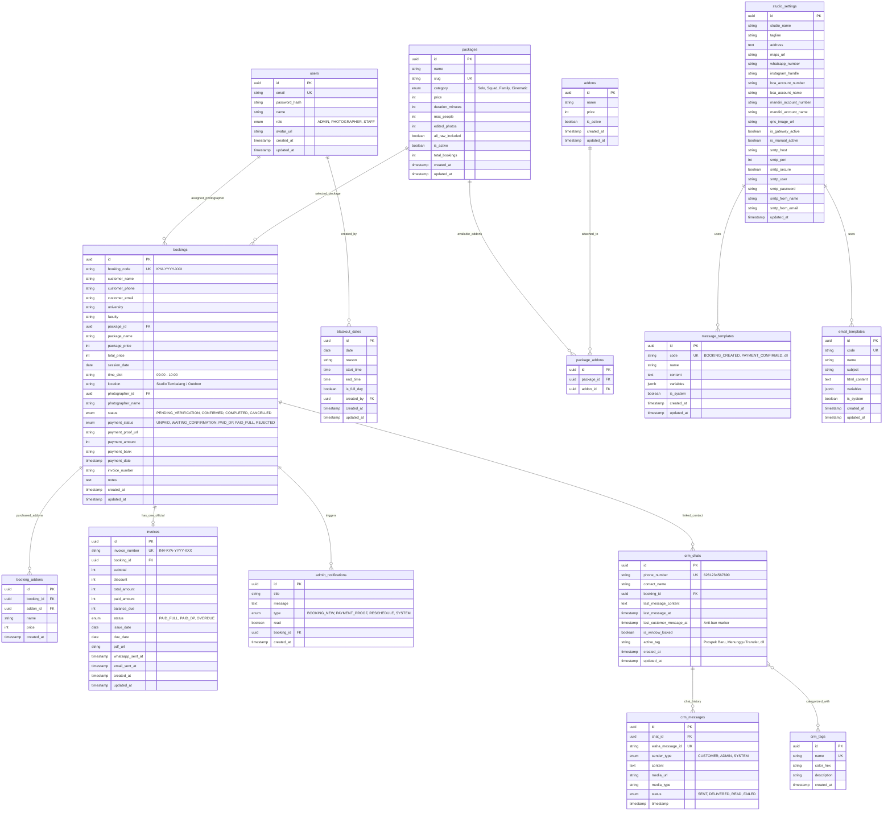
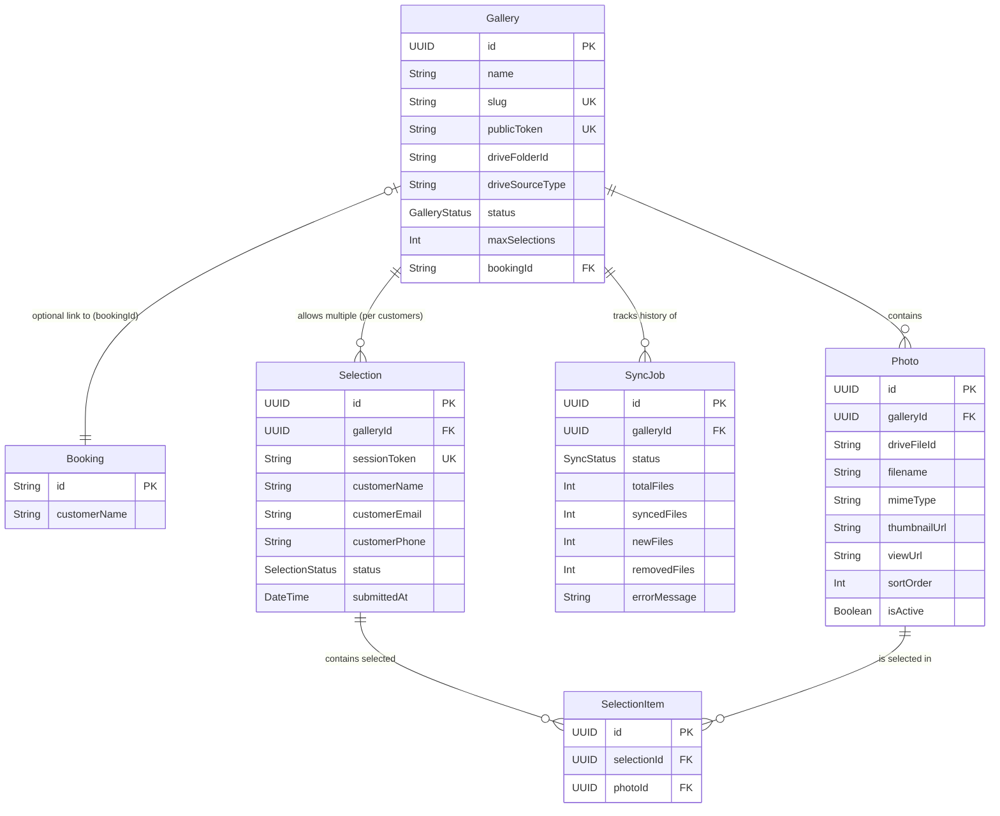

# 🗄️ Spesifikasi Database & Entity Relationship Diagram (ERD)
## Photography Platform Monorepo (Kaya Story Semarang)

- **Database Engine**: PostgreSQL 17 Alpine (`dev-postgres` di `dev-network`)
- **Database Name**: `photography_db`
- **ORM / Client**: Prisma ORM 6.x (`@prisma/client`)
- **Penamaan Standar**: `snake_case` untuk kolom & tabel PostgreSQL, `camelCase` untuk Prisma Model properties.

---

## 1. Visual Entity Relationship Diagram (Mermaid)



---

## 2. Strategi Indexing & Optimasi Query (PostgreSQL Performance)

Untuk memastikan respons API di bawah 100ms dan mencegah lock persaingan saat ribuan calon wisudawan berebut jadwal:

1. **Composite Unique Index Anti Double-Booking**:
   ```sql
   CREATE UNIQUE INDEX idx_unique_booking_slot 
   ON bookings (session_date, time_slot, location) 
   WHERE status IN ('CONFIRMED', 'PENDING_VERIFICATION');
   ```
   *Mencegah secara fisik level database adanya 2 booking aktif pada jam, tanggal, dan lokasi studio yang sama.*

2. **Index Pencarian & Filter Cepat (High Cardinality)**:
   - `bookings(booking_code)`: Pencarian cepat status reservasi pelanggan.
   - `bookings(customer_phone)`: Sinkronisasi nomor WhatsApp dengan histori CRM.
   - `bookings(session_date, status)`: Render jadwal kalender harian/mingguan admin.
   - `invoices(invoice_number)`: Akses langsung halaman cetak dan verifikasi faktur.
   - `crm_chats(last_customer_message_at)`: Query batch penghitungan status kunci jendela 24 jam.

---

## 3. Data Dictionary

Berikut adalah detail lengkap setiap tabel beserta kolom-kolomnya yang esensial.

### Tabel `users`
Tabel yang menyimpan data kredensial dan profil user di dalam sistem (Admin, Staff, Photographer).

| Column | Type | Nullable | Default | Business Meaning |
|---|---|---|---|---|
| `id` | UUID | No | `uuid_generate_v4()` | Primary Key unik tiap user. |
| `email` | String | No | - | Email login (Unique). |
| `password_hash`| String | No | - | Bcrypt hash untuk keamanan password. |
| `name` | String | No | - | Nama lengkap user. |
| `role` | Enum | No | `STAFF` | Peran user: `ADMIN`, `PHOTOGRAPHER`, `STAFF`. |
| `avatar_url` | String | Yes | - | URL untuk foto profil user. |

### Tabel `packages`
Tabel untuk mengatur paket pemotretan yang ditawarkan studio.

| Column | Type | Nullable | Default | Business Meaning |
|---|---|---|---|---|
| `id` | UUID | No | `uuid_generate_v4()` | Primary Key paket. |
| `slug` | String | No | - | Identifier human-readable untuk URL paket (Unique). |
| `category` | Enum | No | - | Kategori paket (`Solo`, `Squad`, `Family`, `Cinematic`). |
| `price` | Int | No | - | Harga dasar paket. |
| `duration_minutes` | Int | No | - | Durasi sesi foto dalam menit. |

### Tabel `bookings`
Tabel utama yang menyimpan seluruh data reservasi.

| Column | Type | Nullable | Default | Business Meaning |
|---|---|---|---|---|
| `id` | UUID | No | `uuid_generate_v4()` | Primary Key booking. |
| `booking_code` | String | No | - | Kode unik KYA-YYYY-XXX untuk pelanggan (Unique). |
| `customer_phone` | String | No | - | Nomor WA pelanggan. |
| `total_price` | Int | No | - | Total harga (Paket + Addons). |
| `session_date` | Date | No | - | Tanggal pelaksanaan sesi foto. |
| `status` | Enum | No | `PENDING_VERIFICATION` | Status reservasi. |

---

## 4. Seeder Data

Berikut adalah contoh SQL query untuk inisialisasi awal (seeder) saat aplikasi pertama kali dijalankan.

```sql
-- Insert Studio Settings
INSERT INTO studio_settings (id, studio_name, tagline, whatsapp_number, is_manual_active, updated_at) 
VALUES ('default-studio', 'Kaya Story Photography', 'Semarang graduation & portrait studio', '6281234567890', true, NOW());

-- Insert Initial Admin
INSERT INTO users (id, email, password_hash, name, role, created_at, updated_at)
VALUES (gen_random_uuid(), 'admin@kayastory.com', '$2b$10$supersecret', 'Admin Utama', 'ADMIN', NOW(), NOW());

-- Insert Initial Packages
INSERT INTO packages (id, name, slug, category, price, duration_minutes, max_people, edited_photos, created_at, updated_at)
VALUES (gen_random_uuid(), 'Solo Kebaya Signature', 'solo-kebaya', 'Solo', 450000, 45, 1, 10, NOW(), NOW());

-- Insert Initial Addon
INSERT INTO addons (id, name, price, is_active, created_at, updated_at)
VALUES (gen_random_uuid(), 'Cetak 10R Kayu', 150000, true, NOW(), NOW());
```

---

## 5. Common Query Patterns (Prisma)

Berikut adalah beberapa pattern query utama yang sering digunakan di backend.

### 5.1 Cek Ketersediaan Slot Waktu
```typescript
const isSlotAvailable = await prisma.booking.findFirst({
  where: {
    sessionDate: targetDate,
    timeSlot: targetSlot,
    status: {
      in: ['CONFIRMED', 'PENDING_VERIFICATION']
    }
  }
});
```

### 5.2 Verifikasi Pembayaran & Auto Update
```typescript
const booking = await prisma.booking.update({
  where: { id: bookingId },
  data: {
    status: 'CONFIRMED',
    paymentStatus: 'PAID_FULL',
    invoice: {
      create: {
        invoiceNumber: generateInvoiceNumber(),
        subtotal: 450000,
        totalAmount: 450000,
        paidAmount: 450000,
        balanceDue: 0
      }
    }
  }
});
```

### 5.3 Cek Status Jendela 24 Jam CRM
```typescript
const chat = await prisma.crmChat.findUnique({
  where: { phoneNumber: customerPhone }
});
const isLocked = dayjs().diff(dayjs(chat.lastCustomerMessageAt), 'hours') >= 24;
```

---

## 6. Migration Strategy

Pengelolaan perubahan skema database dibagi ke dalam pendekatan Dev dan Prod:

- **Local / Development**: Menggunakan `npx prisma migrate dev --name <nama_migrasi>`. Ini akan otomatis melakukan reset pada db lokal jika ada konflik atau drift.
- **Production**:
  1. Build artifact menyimpan file `.sql` dari folder `prisma/migrations`.
  2. Saat CD/Deployment, jalankan `npx prisma migrate deploy` untuk mengaplikasikan migrasi secara aman ke database Production tanpa reset data.
  3. Gunakan `npx prisma db push` HANYA untuk environment non-produksi seperti staging sandbox (bila dibutuhkan).

---

## 7. Representasi Prisma Schema Produksi (`schema.prisma`)

Berikut rancangan skema Prisma lengkap yang disiapkan untuk tahap implementasi di `apps/api/prisma/schema.prisma`:

```prisma
datasource db {
  provider = "postgresql"
  url      = env("DATABASE_URL")
}

generator client {
  provider = "prisma-client-js"
}

enum Role {
  ADMIN
  PHOTOGRAPHER
  STAFF
}

enum PackageCategory {
  Solo
  Squad
  Family
  Cinematic
}

enum BookingStatus {
  PENDING_VERIFICATION
  CONFIRMED
  COMPLETED
  CANCELLED
}

enum PaymentStatus {
  UNPAID
  WAITING_CONFIRMATION
  PAID_DP
  PAID_FULL
  REJECTED
}

enum NotificationType {
  BOOKING_NEW
  PAYMENT_PROOF
  RESCHEDULE
  SYSTEM
}

enum SenderType {
  CUSTOMER
  ADMIN
  SYSTEM
}

enum MessageStatus {
  SENT
  DELIVERED
  READ
  FAILED
}

model User {
  id           String   @id @default(uuid())
  email        String   @unique
  passwordHash String   @map("password_hash")
  name         String
  role         Role     @default(STAFF)
  avatarUrl    String?  @map("avatar_url")
  createdAt    DateTime @default(now()) @map("created_at")
  updatedAt    DateTime @updatedAt @map("updated_at")

  assignedBookings Booking[]      @relation("AssignedPhotographer")
  blackoutDates    BlackoutDate[]

  @@map("users")
}

model Package {
  id             String          @id @default(uuid())
  name           String
  slug           String          @unique
  category       PackageCategory
  price          Int
  durationMinutes Int            @map("duration_minutes")
  maxPeople      Int             @map("max_people")
  editedPhotos   Int             @map("edited_photos")
  allRawIncluded Boolean         @default(true) @map("all_raw_included")
  isActive       Boolean         @default(true) @map("is_active")
  totalBookings  Int             @default(0) @map("total_bookings")
  createdAt      DateTime        @default(now()) @map("created_at")
  updatedAt      DateTime        @updatedAt @map("updated_at")

  bookings      Booking[]
  packageAddons PackageAddon[]

  @@map("packages")
}

model Addon {
  id        String   @id @default(uuid())
  name      String
  price     Int
  isActive  Boolean  @default(true) @map("is_active")
  createdAt DateTime @default(now()) @map("created_at")
  updatedAt DateTime @updatedAt @map("updated_at")

  packageAddons PackageAddon[]
  bookingAddons BookingAddon[]

  @@map("addons")
}

model PackageAddon {
  id        String  @id @default(uuid())
  packageId String  @map("package_id")
  addonId   String  @map("addon_id")
  package   Package @relation(fields: [packageId], references: [id], onDelete: Cascade)
  addon     Addon   @relation(fields: [addonId], references: [id], onDelete: Cascade)

  @@unique([packageId, addonId])
  @@map("package_addons")
}

model Booking {
  id              String        @id @default(uuid())
  bookingCode     String        @unique @map("booking_code")
  customerName    String        @map("customer_name")
  customerPhone   String        @map("customer_phone")
  customerEmail   String        @map("customer_email")
  university      String
  faculty         String?
  packageId       String        @map("package_id")
  packageName     String        @map("package_name")
  packagePrice    Int           @map("package_price")
  totalPrice      Int           @map("total_price")
  sessionDate     DateTime      @map("session_date") @db.Date
  timeSlot        String        @map("time_slot")
  location        String
  photographerId  String?       @map("photographer_id")
  photographerName String?      @map("photographer_name")
  status          BookingStatus @default(PENDING_VERIFICATION)
  paymentStatus   PaymentStatus @default(UNPAID) @map("payment_status")
  paymentProofUrl String?       @map("payment_proof_url")
  paymentAmount   Int?          @map("payment_amount")
  paymentBank     String?       @map("payment_bank")
  paymentDate     DateTime?     @map("payment_date")
  invoiceNumber   String?       @map("invoice_number")
  notes           String?
  createdAt       DateTime      @default(now()) @map("created_at")
  updatedAt       DateTime      @updatedAt @map("updated_at")

  package       Package             @relation(fields: [packageId], references: [id])
  photographer  User?               @relation("AssignedPhotographer", fields: [photographerId], references: [id])
  addons        BookingAddon[]
  invoice       Invoice?
  notifications AdminNotification[]
  crmChats      CrmChat[]

  @@index([sessionDate, status])
  @@index([customerPhone])
  @@map("bookings")
}

model BookingAddon {
  id        String   @id @default(uuid())
  bookingId String   @map("booking_id")
  addonId   String   @map("addon_id")
  name      String
  price     Int
  createdAt DateTime @default(now()) @map("created_at")

  booking Booking @relation(fields: [bookingId], references: [id], onDelete: Cascade)
  addon   Addon   @relation(fields: [addonId], references: [id])

  @@map("booking_addons")
}

model Invoice {
  id             String    @id @default(uuid())
  invoiceNumber  String    @unique @map("invoice_number")
  bookingId      String    @unique @map("booking_id")
  subtotal       Int
  discount       Int       @default(0)
  totalAmount    Int       @map("total_amount")
  paidAmount     Int       @map("paid_amount")
  balanceDue     Int       @map("balance_due")
  status         String    @default("PAID_FULL")
  issueDate      DateTime  @default(now()) @map("issue_date") @db.Date
  dueDate        DateTime? @map("due_date") @db.Date
  pdfUrl         String?   @map("pdf_url")
  whatsappSentAt DateTime? @map("whatsapp_sent_at")
  emailSentAt    DateTime? @map("email_sent_at")
  createdAt      DateTime  @default(now()) @map("created_at")
  updatedAt      DateTime  @updatedAt @map("updated_at")

  booking Booking @relation(fields: [bookingId], references: [id], onDelete: Cascade)

  @@map("invoices")
}

model BlackoutDate {
  id         String   @id @default(uuid())
  date       DateTime @db.Date
  reason     String
  startTime  String?  @map("start_time")
  endTime    String?  @map("end_time")
  isFullDay  Boolean  @default(true) @map("is_full_day")
  createdBy  String   @map("created_by")
  createdAt  DateTime @default(now()) @map("created_at")
  updatedAt  DateTime @updatedAt @map("updated_at")

  author User @relation(fields: [createdBy], references: [id])

  @@map("blackout_dates")
}

model CrmChat {
  id                     String    @id @default(uuid())
  phoneNumber            String    @unique @map("phone_number")
  contactName            String?   @map("contact_name")
  bookingId              String?   @map("booking_id")
  lastMessageContent     String?   @map("last_message_content")
  lastMessageAt          DateTime? @map("last_message_at")
  lastCustomerMessageAt  DateTime? @map("last_customer_message_at")
  isWindowLocked         Boolean   @default(false) @map("is_window_locked")
  activeTag              String?   @default("Prospek Baru") @map("active_tag")
  createdAt              DateTime  @default(now()) @map("created_at")
  updatedAt              DateTime  @updatedAt @map("updated_at")

  booking  Booking?     @relation(fields: [bookingId], references: [id])
  messages CrmMessage[]

  @@map("crm_chats")
}

model CrmMessage {
  id             String        @id @default(uuid())
  chatId         String        @map("chat_id")
  wahaMessageId  String?       @unique @map("waha_message_id")
  senderType     SenderType    @map("sender_type")
  content        String
  mediaUrl       String?       @map("media_url")
  mediaType      String?       @map("media_type")
  status         MessageStatus @default(SENT)
  timestamp      DateTime      @default(now())

  chat CrmChat @relation(fields: [chatId], references: [id], onDelete: Cascade)

  @@map("crm_messages")
}

model MessageTemplate {
  id        String   @id @default(uuid())
  code      String   @unique
  name      String
  content   String
  variables Json     @default("[]")
  isSystem  Boolean  @default(false) @map("is_system")
  createdAt DateTime @default(now()) @map("created_at")
  updatedAt DateTime @updatedAt @map("updated_at")

  @@map("message_templates")
}

model EmailTemplate {
  id          String   @id @default(uuid())
  code        String   @unique
  name        String
  subject     String
  htmlContent String   @map("html_content")
  variables   Json     @default("[]")
  isSystem    Boolean  @default(false) @map("is_system")
  createdAt   DateTime @default(now()) @map("created_at")
  updatedAt   DateTime @updatedAt @map("updated_at")

  @@map("email_templates")
}

model StudioSetting {
  id                    String   @id @default("default-studio")
  studioName            String   @default("Kaya Story Photography") @map("studio_name")
  tagline               String   @default("Semarang graduation & portrait studio")
  address               String   @default("Jl. Banjarsari No. 48, Tembalang, Semarang")
  mapsUrl               String?  @map("maps_url")
  whatsappNumber        String   @default("6281234567890") @map("whatsapp_number")
  instagramHandle       String   @default("@kayastory.id") @map("instagram_handle")
  bcaAccountNumber      String?  @map("bca_account_number")
  bcaAccountName        String?  @map("bca_account_name")
  mandiriAccountNumber  String?  @map("mandiri_account_number")
  mandiriAccountName    String?  @map("mandiri_account_name")
  qrisImageUrl          String?  @map("qris_image_url")
  isGatewayActive       Boolean  @default(false) @map("is_gateway_active")
  isManualActive        Boolean  @default(true) @map("is_manual_active")
  smtpHost              String?  @map("smtp_host")
  smtpPort              Int?     @default(587) @map("smtp_port")
  smtpSecure            Boolean  @default(false) @map("smtp_secure")
  smtpUser              String?  @map("smtp_user")
  smtpPassword          String?  @map("smtp_password")
  smtpFromName          String?  @map("smtp_from_name")
  smtpFromEmail         String?  @map("smtp_from_email")
  updatedAt             DateTime @updatedAt @map("updated_at")

  @@map("studio_settings")
}

model AdminNotification {
  id        String           @id @default(uuid())
  title     String
  message   String
  type      NotificationType @default(SYSTEM)
  read      Boolean          @default(false)
  bookingId String?          @map("booking_id")
  createdAt DateTime         @default(now()) @map("created_at")

  booking Booking? @relation(fields: [bookingId], references: [id])

  @@map("admin_notifications")
}
```

---

## Bagian 2: Database Schema — Fitur Google Drive Gallery

> Dokumen ini sebelumnya terpisah sebagai `06-GALLERY-DATABASE.md`. Digabungkan ke Database ERD utama.

# 06 - GALLERY DATABASE (Database Specification)

**Feature:** Google Drive Public Gallery & Customer Photo Selection
**Database:** PostgreSQL 17
**ORM:** Prisma 6.x

Dokumen ini mendefinisikan rancangan struktur *database* untuk modul Galeri, mencakup relasi entitas, penambahan skema Prisma, strategi indeksasi, kamus data (*data dictionary*), pola kueri (*query patterns*), dan manajemen seeder serta migrasi.

---

## 1. New Tables ERD

Struktur relasi data menggunakan *Entity-Relationship Diagram* (ERD). `Gallery` terhubung opsional ke modul `Booking` yang sudah ada di sistem (jika ingin menautkan galeri ke pesanan spesifik).



---

## 2. Full Prisma Schema Additions

Tambahkan konfigurasi berikut ke dalam file utama `schema.prisma`. 

```prisma
// --- ENUMS ---
enum GalleryStatus {
  DRAFT
  ACTIVE
  ARCHIVED
}

enum SyncStatus {
  PENDING
  RUNNING
  COMPLETED
  FAILED
}

enum SelectionStatus {
  DRAFT
  SUBMITTED
}

// --- MODELS ---

model Gallery {
  id              String        @id @default(uuid()) @db.Uuid
  name            String
  slug            String        @unique
  publicToken     String        @unique @default(cuid())
  driveFolderId   String
  driveSourceType String        @default("google_drive_public")
  status          GalleryStatus @default(DRAFT)
  description     String?       @db.Text
  maxSelections   Int?
  
  // Optional relation to existing Booking model
  bookingId       String?       @db.Uuid
  booking         Booking?      @relation(fields: [bookingId], references: [id])
  
  createdAt       DateTime      @default(now())
  updatedAt       DateTime      @updatedAt

  // Relations
  photos          Photo[]
  syncJobs        SyncJob[]
  selections      Selection[]

  @@map("galleries")
}

model Photo {
  id              String        @id @default(uuid()) @db.Uuid
  galleryId       String        @db.Uuid
  driveFileId     String
  filename        String
  mimeType        String?
  thumbnailUrl    String?       @db.Text
  viewUrl         String?       @db.Text
  sortOrder       Int           @default(0)
  isActive        Boolean       @default(true)
  
  createdAt       DateTime      @default(now())
  updatedAt       DateTime      @updatedAt

  // Relations
  gallery         Gallery       @relation(fields: [galleryId], references: [id], onDelete: Cascade)
  selectionItems  SelectionItem[]

  // Constraints & Indexes
  @@unique([galleryId, driveFileId])
  @@index([galleryId, isActive, sortOrder])
  @@map("photos")
}

model Selection {
  id              String          @id @default(uuid()) @db.Uuid
  galleryId       String          @db.Uuid
  sessionToken    String          @unique @default(cuid())
  customerName    String
  customerEmail   String?
  customerPhone   String?
  status          SelectionStatus @default(DRAFT)
  submittedAt     DateTime?
  
  createdAt       DateTime        @default(now())
  updatedAt       DateTime        @updatedAt

  // Relations
  gallery         Gallery         @relation(fields: [galleryId], references: [id], onDelete: Cascade)
  items           SelectionItem[]

  @@index([galleryId, status])
  @@map("selections")
}

model SelectionItem {
  id              String        @id @default(uuid()) @db.Uuid
  selectionId     String        @db.Uuid
  photoId         String        @db.Uuid
  
  createdAt       DateTime      @default(now())

  // Relations
  selection       Selection     @relation(fields: [selectionId], references: [id], onDelete: Cascade)
  photo           Photo         @relation(fields: [photoId], references: [id], onDelete: Cascade)

  // A photo can only be selected once per selection session
  @@unique([selectionId, photoId])
  @@map("selection_items")
}

model SyncJob {
  id              String        @id @default(uuid()) @db.Uuid
  galleryId       String        @db.Uuid
  status          SyncStatus    @default(PENDING)
  totalFiles      Int?
  syncedFiles     Int           @default(0)
  newFiles        Int           @default(0)
  removedFiles    Int           @default(0)
  errorMessage    String?       @db.Text
  
  startedAt       DateTime?
  completedAt     DateTime?
  createdAt       DateTime      @default(now())
  updatedAt       DateTime      @updatedAt

  // Relations
  gallery         Gallery       @relation(fields: [galleryId], references: [id], onDelete: Cascade)

  @@index([galleryId, status])
  @@map("sync_jobs")
}
```

---

## 3. Index Strategy

Setiap index ditambahkan untuk mengoptimalkan _typical query patterns_ spesifik yang dieksekusi secara berulang:

1. **`@@index([galleryId, isActive, sortOrder])` (pada tabel `Photo`)**
   * **Rasional:** Saat *customer* membuka halaman galeri publik, API wajib mengembalikan daftar foto secara tersortir (berdasarkan urutan abjad dari parser) dan mem-filter hanya foto yang `isActive = true`. Kombinasi ketiga kolom ini membuat PostgreSQL dapat menyajikan *pagination* (menggunakan LIMIT & OFFSET) murni dari indeks tanpa harus membaca (mengakses) data fisik dari tabel terlebih dahulu.
2. **`@@index([galleryId, status])` (pada tabel `SyncJob`)**
   * **Rasional:** Setiap kali admin menekan tombol sinkronisasi, sistem harus dengan cepat memvalidasi *business rule* "Tidak boleh ada sync berbarengan". Kueri pencarian pekerjaan berstatus `RUNNING` atau `PENDING` untuk suatu galeri akan berjalan sangat cepat menggunakan composite index ini.
3. **`@@index([galleryId, status])` (pada tabel `Selection`)**
   * **Rasional:** Admin *dashboard* memerlukan rekap dari siapa saja pelanggan yang sudah `SUBMITTED` pada galeri tertentu. Index ini mempercepat load data untuk dasbor panel admin.
4. **Unique Constraints (`@@unique`)**
   * `[galleryId, driveFileId]` pada `Photo`: Mencegah insersi duplikat secara absolut saat proses _Bulk Upsert_ terjadi dari `BullMQ worker`.
   * `[selectionId, photoId]` pada `SelectionItem`: Menjaga integritas data agar *customer* tidak bisa mengirim foto yang sama lebih dari satu kali dalam suatu daftar pilihannya.

---

## 4. Data Dictionary

### Tabel `galleries`
| Kolom | Tipe | Constraints / Default | Deskripsi Bisnis |
| :--- | :--- | :--- | :--- |
| `publicToken` | String | Unique, default(cuid()) | URL slug/token publik rahasia, tak tertebak, digunakan untuk link klien. |
| `driveFolderId` | String | - | ID asli dari Google Drive (ex: `1aBcDeFg`). |
| `driveSourceType`| String | default('google_drive_public') | Flag untuk ekstensi sumber foto (S3, R2) di masa depan. |
| `maxSelections` | Int | Nullable | Jumlah maksimal foto yang boleh dipilih oleh klien. Jika `null`, tak terbatas. |

### Tabel `photos`
| Kolom | Tipe | Constraints / Default | Deskripsi Bisnis |
| :--- | :--- | :--- | :--- |
| `driveFileId` | String | - | ID spesifik file gambar pada Google Drive. |
| `thumbnailUrl` | Text | Nullable | URL akses CDN dari drive google (`.../thumbnail?id=...&sz=w400`). |
| `sortOrder` | Int | default(0) | Urutan tampilan foto (berguna jika admin mau merombak letak). |
| `isActive` | Boolean | default(true) | Menandakan file tersebut eksis di Drive. Jika dihapus dari drive, ubah ke `false`. |

---

## 5. Common Query Patterns

Contoh pola kueri menggunakan Prisma Client yang mencerminkan pemrosesan bisnis inti.

**1. Mengambil foto aktif dengan paginasi (Public View):**
```typescript
const getPublicPhotos = async (galleryId: string, page: number, limit: number) => {
  return await prisma.photo.findMany({
    where: { 
      galleryId, 
      isActive: true 
    },
    orderBy: { sortOrder: 'asc' },
    skip: (page - 1) * limit,
    take: limit,
    select: {
      id: true,
      filename: true,
      thumbnailUrl: true,
      viewUrl: true
    }
  });
};
```

**2. Memeriksa ketersediaan proses sinkronisasi (Sync Guard):**
```typescript
const isSyncRunning = async (galleryId: string) => {
  const activeJob = await prisma.syncJob.findFirst({
    where: {
      galleryId,
      status: { in: ['PENDING', 'RUNNING'] },
    },
  });
  return !!activeJob;
};
```

**3. Pembaruan/Upsert data metadata foto secara massal:**
*Catatan: Prisma v6 merekomendasikan `createMany` dengan `onConflict` (pada PostgreSQL) atau transaksional upsert.*
```typescript
const upsertPhotos = async (galleryId: string, photos: DrivePhoto[]) => {
  return await prisma.$transaction(
    photos.map((photo) =>
      prisma.photo.upsert({
        where: {
          galleryId_driveFileId: {
            galleryId,
            driveFileId: photo.id,
          },
        },
        update: {
          filename: photo.name,
          thumbnailUrl: photo.thumbnail,
          isActive: true, // Reactivate jika dulunya dihapus
        },
        create: {
          galleryId,
          driveFileId: photo.id,
          filename: photo.name,
          mimeType: photo.mimeType,
          thumbnailUrl: photo.thumbnail,
          viewUrl: photo.url,
          isActive: true,
        },
      })
    )
  );
};
```

**4. Validasi dan Penyelesaian Draf Pilihan (*Submit Selection*):**
```typescript
const submitSelection = async (sessionToken: string, maxLimit: number) => {
  const selection = await prisma.selection.findUnique({
    where: { sessionToken },
    include: { _count: { select: { items: true } } }
  });

  if (selection._count.items > maxLimit) {
    throw new Error('SELECTION_MAX_EXCEEDED');
  }

  return await prisma.selection.update({
    where: { sessionToken },
    data: {
      status: 'SUBMITTED',
      submittedAt: new Date()
    }
  });
};
```

**5. Pengambilan Detail Pilihan (Admin View):**
```typescript
const getAdminSelection = async (galleryId: string) => {
  return await prisma.selection.findMany({
    where: { galleryId, status: 'SUBMITTED' },
    include: {
      items: {
        include: { photo: true } // Ambil data URL dan filename dari foto yang dipilih
      }
    },
    orderBy: { submittedAt: 'desc' }
  });
};
```

---

## 6. Seeder Data

Skrip data awal atau purwarupa (seeder) dalam bentuk RAW SQL untuk di-inject pada _development environment_.

```sql
-- 1. Insert Sample Gallery
INSERT INTO "galleries" (
  "id", "name", "slug", "publicToken", "driveFolderId", 
  "status", "maxSelections", "createdAt", "updatedAt"
) VALUES (
  'a1b2c3d4-e5f6-7a8b-9c0d-1e2f3a4b5c6d',
  'Prewedding Budi & Ani',
  'prewed-budi-ani',
  'clh123xzy0000abcde123',
  '1A2b3C4d5E6f7G8h9I0jK',
  'ACTIVE',
  30,
  NOW(),
  NOW()
);

-- 2. Insert 5 Sample Photos
INSERT INTO "photos" (
  "id", "galleryId", "driveFileId", "filename", "mimeType", 
  "thumbnailUrl", "sortOrder", "isActive", "createdAt", "updatedAt"
) VALUES 
('11111111-1111-1111-1111-111111111111', 'a1b2c3d4-e5f6-7a8b-9c0d-1e2f3a4b5c6d', 'dFile1', 'IMG_001.jpg', 'image/jpeg', 'https://drive.google.com/thumbnail?id=dFile1&sz=w400', 1, true, NOW(), NOW()),
('22222222-2222-2222-2222-222222222222', 'a1b2c3d4-e5f6-7a8b-9c0d-1e2f3a4b5c6d', 'dFile2', 'IMG_002.jpg', 'image/jpeg', 'https://drive.google.com/thumbnail?id=dFile2&sz=w400', 2, true, NOW(), NOW()),
('33333333-3333-3333-3333-333333333333', 'a1b2c3d4-e5f6-7a8b-9c0d-1e2f3a4b5c6d', 'dFile3', 'IMG_003.jpg', 'image/jpeg', 'https://drive.google.com/thumbnail?id=dFile3&sz=w400', 3, true, NOW(), NOW()),
('44444444-4444-4444-4444-444444444444', 'a1b2c3d4-e5f6-7a8b-9c0d-1e2f3a4b5c6d', 'dFile4', 'IMG_004.jpg', 'image/jpeg', 'https://drive.google.com/thumbnail?id=dFile4&sz=w400', 4, true, NOW(), NOW()),
('55555555-5555-5555-5555-555555555555', 'a1b2c3d4-e5f6-7a8b-9c0d-1e2f3a4b5c6d', 'dFile5', 'IMG_005.jpg', 'image/jpeg', 'https://drive.google.com/thumbnail?id=dFile5&sz=w400', 5, true, NOW(), NOW());

-- 3. Insert 1 Sample Selection (Draft)
INSERT INTO "selections" (
  "id", "galleryId", "sessionToken", "customerName", "status", "createdAt", "updatedAt"
) VALUES (
  '99999999-9999-9999-9999-999999999999',
  'a1b2c3d4-e5f6-7a8b-9c0d-1e2f3a4b5c6d',
  'cls123token999000',
  'Budi Santoso',
  'DRAFT',
  NOW(),
  NOW()
);

-- 4. Insert 3 Selection Items for the session
INSERT INTO "selection_items" ("id", "selectionId", "photoId", "createdAt") VALUES
(gen_random_uuid(), '99999999-9999-9999-9999-999999999999', '11111111-1111-1111-1111-111111111111', NOW()),
(gen_random_uuid(), '99999999-9999-9999-9999-999999999999', '22222222-2222-2222-2222-222222222222', NOW()),
(gen_random_uuid(), '99999999-9999-9999-9999-999999999999', '55555555-5555-5555-5555-555555555555', NOW());
```

---

## 7. Migration Strategy

1. **Development Environment:**
   * Di dalam container Docker atau saat menjalankan script lokal, migrasi diselesaikan menggunakan perintah sinkronisasi skema otomatis `npx prisma db push`. Ini sangat sesuai dengan integrasi script `docker-entrypoint.sh` saat *booting* aplikasi.
2. **Production Environment:**
   * Setiap penambahan model skema wajib ditangkap (dijadikan file migrasi statis) terlebih dahulu sebelum diterapkan ke production:
     ```bash
     npx prisma migrate dev --name init_gallery_module
     ```
   * Di server *production*, eksekusi migrasi menggunakan:
     ```bash
     npx prisma migrate deploy
     ```
3. **Handling Optional Relations (`Booking` module):**
   * Relasi opsional `bookingId` dikonfigurasi sebagai *nullable*.
   * Jika pada rilis awal model `Booking` belum stabil atau masih sering direvisi, skema `Gallery` tidak akan rusak / *broken*. Ketika me-load relasi dengan `include: { booking: true }`, Prisma tetap aman dan akan mengembalikan `null` tanpa *error* jika foreign key tidak diatur.
   * Apabila model Booking dihapus di *development*, maka field di tabel `Gallery` tersebut akan memberikan *type error* secara eksplisit sehingga mencegah ketidaksinkronan kode sumber.
