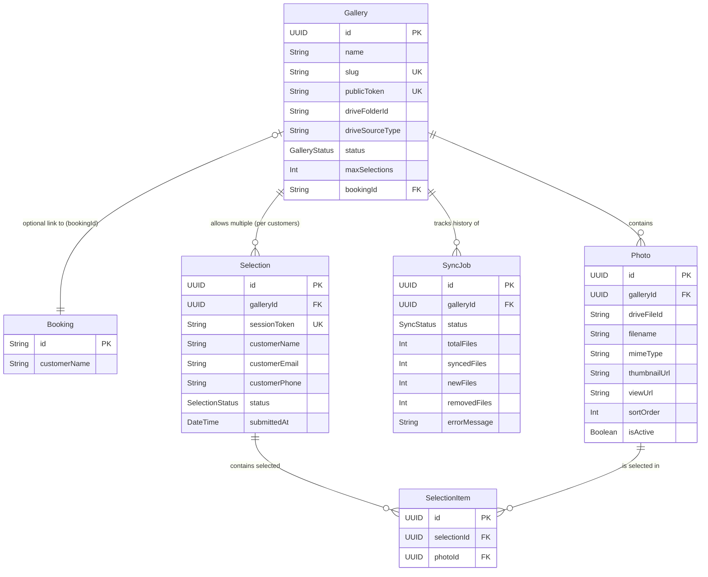

# 06 - GALLERY DATABASE (Database Specification)

**Feature:** Google Drive Public Gallery & Customer Photo Selection
**Database:** PostgreSQL 17
**ORM:** Prisma 6.x

Dokumen ini mendefinisikan rancangan struktur *database* untuk modul Galeri, mencakup relasi entitas, penambahan skema Prisma, strategi indeksasi, kamus data (*data dictionary*), pola kueri (*query patterns*), dan manajemen seeder serta migrasi.

---

## 1. New Tables ERD

Struktur relasi data menggunakan *Entity-Relationship Diagram* (ERD). `Gallery` terhubung opsional ke modul `Booking` yang sudah ada di sistem (jika ingin menautkan galeri ke pesanan spesifik).



---

## 2. Full Prisma Schema Additions

Tambahkan konfigurasi berikut ke dalam file utama `schema.prisma`. 

```prisma
// --- ENUMS ---
enum GalleryStatus {
  DRAFT
  ACTIVE
  ARCHIVED
}

enum SyncStatus {
  PENDING
  RUNNING
  COMPLETED
  FAILED
}

enum SelectionStatus {
  DRAFT
  SUBMITTED
}

// --- MODELS ---

model Gallery {
  id              String        @id @default(uuid()) @db.Uuid
  name            String
  slug            String        @unique
  publicToken     String        @unique @default(cuid())
  driveFolderId   String
  driveSourceType String        @default("google_drive_public")
  status          GalleryStatus @default(DRAFT)
  description     String?       @db.Text
  maxSelections   Int?
  
  // Optional relation to existing Booking model
  bookingId       String?       @db.Uuid
  booking         Booking?      @relation(fields: [bookingId], references: [id])
  
  createdAt       DateTime      @default(now())
  updatedAt       DateTime      @updatedAt

  // Relations
  photos          Photo[]
  syncJobs        SyncJob[]
  selections      Selection[]

  @@map("galleries")
}

model Photo {
  id              String        @id @default(uuid()) @db.Uuid
  galleryId       String        @db.Uuid
  driveFileId     String
  filename        String
  mimeType        String?
  thumbnailUrl    String?       @db.Text
  viewUrl         String?       @db.Text
  sortOrder       Int           @default(0)
  isActive        Boolean       @default(true)
  
  createdAt       DateTime      @default(now())
  updatedAt       DateTime      @updatedAt

  // Relations
  gallery         Gallery       @relation(fields: [galleryId], references: [id], onDelete: Cascade)
  selectionItems  SelectionItem[]

  // Constraints & Indexes
  @@unique([galleryId, driveFileId])
  @@index([galleryId, isActive, sortOrder])
  @@map("photos")
}

model Selection {
  id              String          @id @default(uuid()) @db.Uuid
  galleryId       String          @db.Uuid
  sessionToken    String          @unique @default(cuid())
  customerName    String
  customerEmail   String?
  customerPhone   String?
  status          SelectionStatus @default(DRAFT)
  submittedAt     DateTime?
  
  createdAt       DateTime        @default(now())
  updatedAt       DateTime        @updatedAt

  // Relations
  gallery         Gallery         @relation(fields: [galleryId], references: [id], onDelete: Cascade)
  items           SelectionItem[]

  @@index([galleryId, status])
  @@map("selections")
}

model SelectionItem {
  id              String        @id @default(uuid()) @db.Uuid
  selectionId     String        @db.Uuid
  photoId         String        @db.Uuid
  
  createdAt       DateTime      @default(now())

  // Relations
  selection       Selection     @relation(fields: [selectionId], references: [id], onDelete: Cascade)
  photo           Photo         @relation(fields: [photoId], references: [id], onDelete: Cascade)

  // A photo can only be selected once per selection session
  @@unique([selectionId, photoId])
  @@map("selection_items")
}

model SyncJob {
  id              String        @id @default(uuid()) @db.Uuid
  galleryId       String        @db.Uuid
  status          SyncStatus    @default(PENDING)
  totalFiles      Int?
  syncedFiles     Int           @default(0)
  newFiles        Int           @default(0)
  removedFiles    Int           @default(0)
  errorMessage    String?       @db.Text
  
  startedAt       DateTime?
  completedAt     DateTime?
  createdAt       DateTime      @default(now())
  updatedAt       DateTime      @updatedAt

  // Relations
  gallery         Gallery       @relation(fields: [galleryId], references: [id], onDelete: Cascade)

  @@index([galleryId, status])
  @@map("sync_jobs")
}
```

---

## 3. Index Strategy

Setiap index ditambahkan untuk mengoptimalkan _typical query patterns_ spesifik yang dieksekusi secara berulang:

1. **`@@index([galleryId, isActive, sortOrder])` (pada tabel `Photo`)**
   * **Rasional:** Saat *customer* membuka halaman galeri publik, API wajib mengembalikan daftar foto secara tersortir (berdasarkan urutan abjad dari parser) dan mem-filter hanya foto yang `isActive = true`. Kombinasi ketiga kolom ini membuat PostgreSQL dapat menyajikan *pagination* (menggunakan LIMIT & OFFSET) murni dari indeks tanpa harus membaca (mengakses) data fisik dari tabel terlebih dahulu.
2. **`@@index([galleryId, status])` (pada tabel `SyncJob`)**
   * **Rasional:** Setiap kali admin menekan tombol sinkronisasi, sistem harus dengan cepat memvalidasi *business rule* "Tidak boleh ada sync berbarengan". Kueri pencarian pekerjaan berstatus `RUNNING` atau `PENDING` untuk suatu galeri akan berjalan sangat cepat menggunakan composite index ini.
3. **`@@index([galleryId, status])` (pada tabel `Selection`)**
   * **Rasional:** Admin *dashboard* memerlukan rekap dari siapa saja pelanggan yang sudah `SUBMITTED` pada galeri tertentu. Index ini mempercepat load data untuk dasbor panel admin.
4. **Unique Constraints (`@@unique`)**
   * `[galleryId, driveFileId]` pada `Photo`: Mencegah insersi duplikat secara absolut saat proses _Bulk Upsert_ terjadi dari `BullMQ worker`.
   * `[selectionId, photoId]` pada `SelectionItem`: Menjaga integritas data agar *customer* tidak bisa mengirim foto yang sama lebih dari satu kali dalam suatu daftar pilihannya.

---

## 4. Data Dictionary

### Tabel `galleries`
| Kolom | Tipe | Constraints / Default | Deskripsi Bisnis |
| :--- | :--- | :--- | :--- |
| `publicToken` | String | Unique, default(cuid()) | URL slug/token publik rahasia, tak tertebak, digunakan untuk link klien. |
| `driveFolderId` | String | - | ID asli dari Google Drive (ex: `1aBcDeFg`). |
| `driveSourceType`| String | default('google_drive_public') | Flag untuk ekstensi sumber foto (S3, R2) di masa depan. |
| `maxSelections` | Int | Nullable | Jumlah maksimal foto yang boleh dipilih oleh klien. Jika `null`, tak terbatas. |

### Tabel `photos`
| Kolom | Tipe | Constraints / Default | Deskripsi Bisnis |
| :--- | :--- | :--- | :--- |
| `driveFileId` | String | - | ID spesifik file gambar pada Google Drive. |
| `thumbnailUrl` | Text | Nullable | URL akses CDN dari drive google (`.../thumbnail?id=...&sz=w400`). |
| `sortOrder` | Int | default(0) | Urutan tampilan foto (berguna jika admin mau merombak letak). |
| `isActive` | Boolean | default(true) | Menandakan file tersebut eksis di Drive. Jika dihapus dari drive, ubah ke `false`. |

---

## 5. Common Query Patterns

Contoh pola kueri menggunakan Prisma Client yang mencerminkan pemrosesan bisnis inti.

**1. Mengambil foto aktif dengan paginasi (Public View):**
```typescript
const getPublicPhotos = async (galleryId: string, page: number, limit: number) => {
  return await prisma.photo.findMany({
    where: { 
      galleryId, 
      isActive: true 
    },
    orderBy: { sortOrder: 'asc' },
    skip: (page - 1) * limit,
    take: limit,
    select: {
      id: true,
      filename: true,
      thumbnailUrl: true,
      viewUrl: true
    }
  });
};
```

**2. Memeriksa ketersediaan proses sinkronisasi (Sync Guard):**
```typescript
const isSyncRunning = async (galleryId: string) => {
  const activeJob = await prisma.syncJob.findFirst({
    where: {
      galleryId,
      status: { in: ['PENDING', 'RUNNING'] },
    },
  });
  return !!activeJob;
};
```

**3. Pembaruan/Upsert data metadata foto secara massal:**
*Catatan: Prisma v6 merekomendasikan `createMany` dengan `onConflict` (pada PostgreSQL) atau transaksional upsert.*
```typescript
const upsertPhotos = async (galleryId: string, photos: DrivePhoto[]) => {
  return await prisma.$transaction(
    photos.map((photo) =>
      prisma.photo.upsert({
        where: {
          galleryId_driveFileId: {
            galleryId,
            driveFileId: photo.id,
          },
        },
        update: {
          filename: photo.name,
          thumbnailUrl: photo.thumbnail,
          isActive: true, // Reactivate jika dulunya dihapus
        },
        create: {
          galleryId,
          driveFileId: photo.id,
          filename: photo.name,
          mimeType: photo.mimeType,
          thumbnailUrl: photo.thumbnail,
          viewUrl: photo.url,
          isActive: true,
        },
      })
    )
  );
};
```

**4. Validasi dan Penyelesaian Draf Pilihan (*Submit Selection*):**
```typescript
const submitSelection = async (sessionToken: string, maxLimit: number) => {
  const selection = await prisma.selection.findUnique({
    where: { sessionToken },
    include: { _count: { select: { items: true } } }
  });

  if (selection._count.items > maxLimit) {
    throw new Error('SELECTION_MAX_EXCEEDED');
  }

  return await prisma.selection.update({
    where: { sessionToken },
    data: {
      status: 'SUBMITTED',
      submittedAt: new Date()
    }
  });
};
```

**5. Pengambilan Detail Pilihan (Admin View):**
```typescript
const getAdminSelection = async (galleryId: string) => {
  return await prisma.selection.findMany({
    where: { galleryId, status: 'SUBMITTED' },
    include: {
      items: {
        include: { photo: true } // Ambil data URL dan filename dari foto yang dipilih
      }
    },
    orderBy: { submittedAt: 'desc' }
  });
};
```

---

## 6. Seeder Data

Skrip data awal atau purwarupa (seeder) dalam bentuk RAW SQL untuk di-inject pada _development environment_.

```sql
-- 1. Insert Sample Gallery
INSERT INTO "galleries" (
  "id", "name", "slug", "publicToken", "driveFolderId", 
  "status", "maxSelections", "createdAt", "updatedAt"
) VALUES (
  'a1b2c3d4-e5f6-7a8b-9c0d-1e2f3a4b5c6d',
  'Prewedding Budi & Ani',
  'prewed-budi-ani',
  'clh123xzy0000abcde123',
  '1A2b3C4d5E6f7G8h9I0jK',
  'ACTIVE',
  30,
  NOW(),
  NOW()
);

-- 2. Insert 5 Sample Photos
INSERT INTO "photos" (
  "id", "galleryId", "driveFileId", "filename", "mimeType", 
  "thumbnailUrl", "sortOrder", "isActive", "createdAt", "updatedAt"
) VALUES 
('11111111-1111-1111-1111-111111111111', 'a1b2c3d4-e5f6-7a8b-9c0d-1e2f3a4b5c6d', 'dFile1', 'IMG_001.jpg', 'image/jpeg', 'https://drive.google.com/thumbnail?id=dFile1&sz=w400', 1, true, NOW(), NOW()),
('22222222-2222-2222-2222-222222222222', 'a1b2c3d4-e5f6-7a8b-9c0d-1e2f3a4b5c6d', 'dFile2', 'IMG_002.jpg', 'image/jpeg', 'https://drive.google.com/thumbnail?id=dFile2&sz=w400', 2, true, NOW(), NOW()),
('33333333-3333-3333-3333-333333333333', 'a1b2c3d4-e5f6-7a8b-9c0d-1e2f3a4b5c6d', 'dFile3', 'IMG_003.jpg', 'image/jpeg', 'https://drive.google.com/thumbnail?id=dFile3&sz=w400', 3, true, NOW(), NOW()),
('44444444-4444-4444-4444-444444444444', 'a1b2c3d4-e5f6-7a8b-9c0d-1e2f3a4b5c6d', 'dFile4', 'IMG_004.jpg', 'image/jpeg', 'https://drive.google.com/thumbnail?id=dFile4&sz=w400', 4, true, NOW(), NOW()),
('55555555-5555-5555-5555-555555555555', 'a1b2c3d4-e5f6-7a8b-9c0d-1e2f3a4b5c6d', 'dFile5', 'IMG_005.jpg', 'image/jpeg', 'https://drive.google.com/thumbnail?id=dFile5&sz=w400', 5, true, NOW(), NOW());

-- 3. Insert 1 Sample Selection (Draft)
INSERT INTO "selections" (
  "id", "galleryId", "sessionToken", "customerName", "status", "createdAt", "updatedAt"
) VALUES (
  '99999999-9999-9999-9999-999999999999',
  'a1b2c3d4-e5f6-7a8b-9c0d-1e2f3a4b5c6d',
  'cls123token999000',
  'Budi Santoso',
  'DRAFT',
  NOW(),
  NOW()
);

-- 4. Insert 3 Selection Items for the session
INSERT INTO "selection_items" ("id", "selectionId", "photoId", "createdAt") VALUES
(gen_random_uuid(), '99999999-9999-9999-9999-999999999999', '11111111-1111-1111-1111-111111111111', NOW()),
(gen_random_uuid(), '99999999-9999-9999-9999-999999999999', '22222222-2222-2222-2222-222222222222', NOW()),
(gen_random_uuid(), '99999999-9999-9999-9999-999999999999', '55555555-5555-5555-5555-555555555555', NOW());
```

---

## 7. Migration Strategy

1. **Development Environment:**
   * Di dalam container Docker atau saat menjalankan script lokal, migrasi diselesaikan menggunakan perintah sinkronisasi skema otomatis `npx prisma db push`. Ini sangat sesuai dengan integrasi script `docker-entrypoint.sh` saat *booting* aplikasi.
2. **Production Environment:**
   * Setiap penambahan model skema wajib ditangkap (dijadikan file migrasi statis) terlebih dahulu sebelum diterapkan ke production:
     ```bash
     npx prisma migrate dev --name init_gallery_module
     ```
   * Di server *production*, eksekusi migrasi menggunakan:
     ```bash
     npx prisma migrate deploy
     ```
3. **Handling Optional Relations (`Booking` module):**
   * Relasi opsional `bookingId` dikonfigurasi sebagai *nullable*.
   * Jika pada rilis awal model `Booking` belum stabil atau masih sering direvisi, skema `Gallery` tidak akan rusak / *broken*. Ketika me-load relasi dengan `include: { booking: true }`, Prisma tetap aman dan akan mengembalikan `null` tanpa *error* jika foreign key tidak diatur.
   * Apabila model Booking dihapus di *development*, maka field di tabel `Gallery` tersebut akan memberikan *type error* secara eksplisit sehingga mencegah ketidaksinkronan kode sumber.
